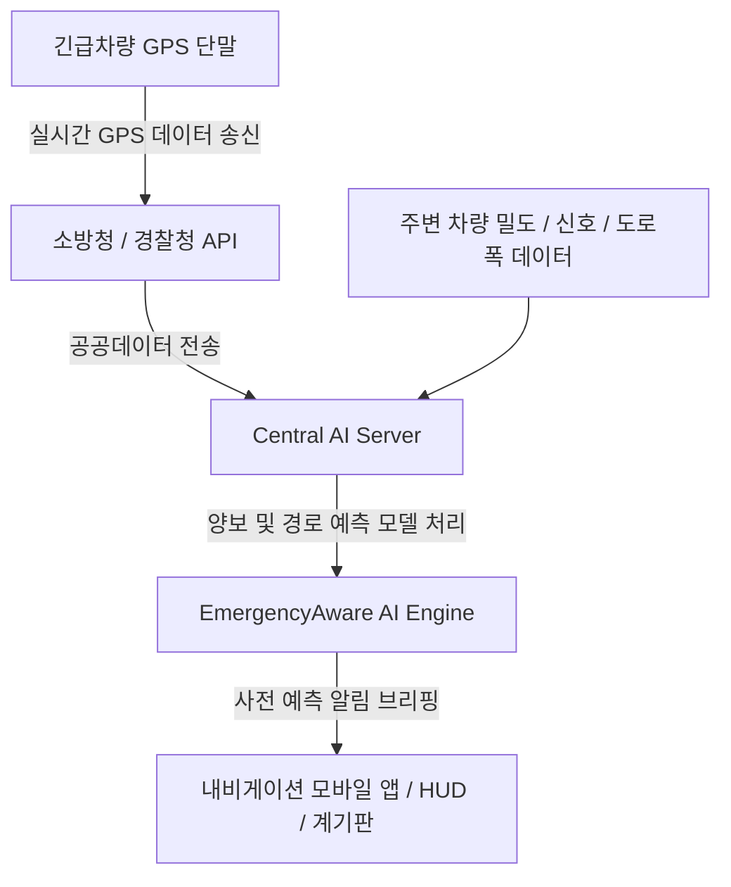

# 🚑 EmergencyAware AI

> **"AI로 (시간낭비)를 없앤다면"** — 긴급차량 사전 알림 AI 내비게이션 서비스
> **한국공학대학교 3팀**

<p align="center">
  
  
  
  
</p>

---

## 📌 프로젝트 소개

**EmergencyAware**는 운전자가 긴급차량(구급차, 소방차 등)을 직접 눈으로 보거나 사이렌 소리를 듣기 전에, **AI 기반 위치 예측 및 사전 알림 기술**을 통해 내비게이션 화면에서 선제적으로 대응할 수 있도록 돕는 서비스입니다.

소음이나 사각지대로 인해 늦어지는 반응 속도를 획기적으로 단축하여 **응급환자의 골든타임을 확보**하고, 갑작스러운 양보로 인한 **2차 교통사고를 예방**합니다.

---

## 🚨 문제 정의 : 왜 지금 방식으로는 부족한가?

현재의 긴급 차량 양보 방식은 운전자의 **청각(사이렌)과 시각(직접 확인)**에만 전적으로 의존합니다.

- **터널 소음 및 음악 청취**: 방음이 잘 되는 현대 차량 내부에서는 사이렌 인지 시점이 너무 늦습니다.
- **시야 확보의 한계**: 고층 차량이나 굽은 도로(사각지대)에서는 경광등을 발견하기 어렵습니다.
- **반응적 대응의 위험성**: 뒤늦게 인지하여 급제동 및 급차선 변경을 시도할 경우, **2차 교통사고**를 유발합니다.
- **골든타임 소실**: 구급차 현장 도착이 **1분 지연될 때마다 심정지 환자의 생존율은 7~10% 감소**합니다.

---

## ✨ 핵심 혁신 : 반응형(Reactive)에서 예측형(Predictive)으로

| 기존 방식 (Conventional)              | EmergencyAware 혁신 (AI-Powered)                     |
| :------------------------------------ | :--------------------------------------------------- |
| ❌ 직접 들리거나 보일 때까지 대기     | ⚡**AI 선제적 인지**: 500m~1km 전부터 정보 수신      |
| ❌ 당황하여 급제동 / 무리한 차선 변경 | ⚡**여유 있는 준비**: 미리 차선 변경 및 감속 준비    |
| ❌ 기상 악화, 소음, 사각지대에 취약   | ⚡**전천후 예측**: 환경적 영향 없이 정확한 예측 안내 |

---

## 🛠️ 핵심 기능

### 1. 3단계 맞춤형 사전 알림 (Safe ➡️ Warning ➡️ Danger)

거리에 따라 운전자가 차례로 준비할 수 있도록 **3단계 시각 및 음성 가이드**를 제공합니다.

- **1단계 (안전/Safe):** 주변에 접근 중인 긴급 차량이 없습니다.
- **2단계 (경고/Warning - 1km 뒤):** "⚠️ 1km 뒤에서 구급차가 접근 중입니다." (양보 준비 및 서행)
- **3단계 (위험/Danger - 500m 뒤):** "🚨 500m 뒤 구급차 접근! 우측으로 양보해주세요." (신속하고 안전한 차선 변경)
- **4단계 (통과 중/Passing):** "🚑 구급차가 옆을 지나가고 있습니다."
- **5단계 (통과 완료/Passed):** "✅ 구급차가 통과했습니다. 안전 운전하세요."

### 2. 실시간 지도 오버레이 및 경로 예측 AI

- 소방청/경찰청 실시간 API 데이터와 커넥티드카 플랫폼의 정보를 수집합니다.
- 긴급차량의 이동 방향 및 속도 데이터를 기반으로 교차로 등에서의 충돌 예상 지점을 계산하여 선제 안내합니다.

---

## 🌐 AI 기술 아키텍처 (Data Flow)



---

## 📈 기대 효과

1. **응급 골든타임 단축**: 사전 준비를 통한 반응 시간 단축으로 현장 도착 시간 1분 이상 단축 ➡️ **생존율 상승**
2. **2차 사고 예방**: 급차선 변경이나 급제동 없이 여유 있고 안전한 양보 유도
3. **교통 흐름 효율화**: 도시 내 긴급차량 통행 경로 사전 확보를 통해 전반적인 교통 흐름 개선

---

## 💻 시뮬레이터 실행 방법 (Getting Started)

이 레포지토리에는 **React + Vite + Tailwind CSS**로 구축된 **EmergencyAware AI 내비게이션 시뮬레이터**가 포함되어 있습니다.

### 1. 의존성 설치

```bash
npm install
```

### 2. 로컬 개발 서버 실행

```bash
npm run dev
```

실행 후 터미널에 나타나는 로컬 호스트 주소(기본: `http://localhost:5173`)로 접속하여 시뮬레이션을 작동해 볼 수 있습니다.

---

## 👥 팀원 및 역할 (TKU Team 3)

- **소속**: 한국공학대학교 (TKU) 3팀
- **팀원**: 김려은 · 김성준 · 송동원 · 송현수 · 유준서 · 이우진
